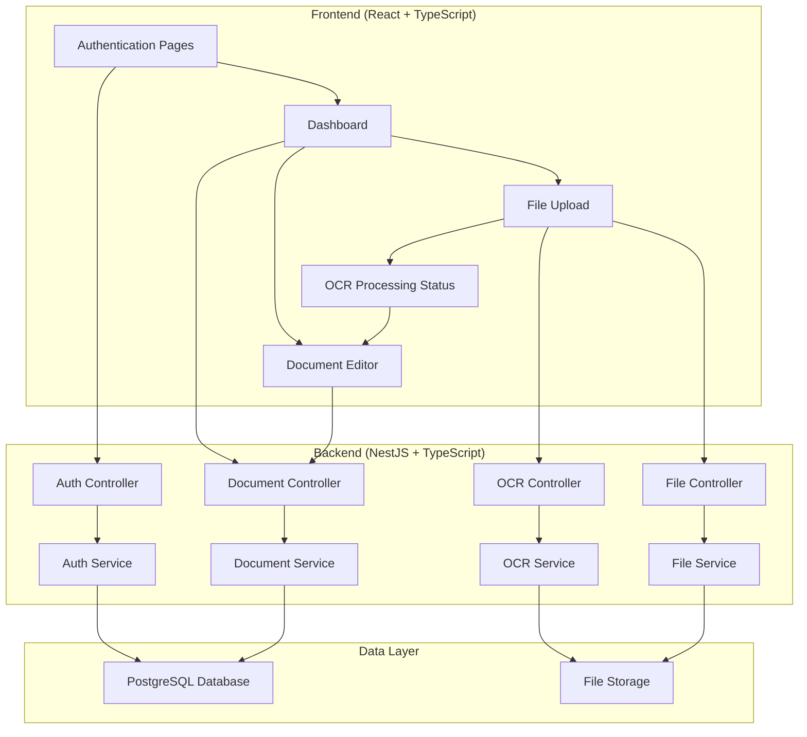

# Design Document

## Overview

Ink & Keys is designed as a modern full-stack web application that combines traditional document editing capabilities with OCR processing for handwritten content. The architecture follows a clean separation between frontend and backend, with a RESTful API serving as the communication layer. The system is containerized using Docker for easy deployment and development setup.

## Architecture

### High-Level Architecture



### Technology Stack (All Free/Open Source)

- **Frontend**: React 18 with TypeScript, Vite for build tooling
- **Backend**: NestJS with TypeScript, Express.js foundation
- **Database**: PostgreSQL 15 with Prisma ORM (free tier on Render/Railway)
- **Authentication**: JWT tokens with bcrypt password hashing
- **File Storage**: Local filesystem (free tier limits on deployment platforms)
- **OCR Processing**: OpenCV + Tesseract (completely free open-source libraries)
- **Containerization**: Docker with Docker Compose
- **Rich Text Editor**: TipTap (free open-source editor)
- **Deployment**: Vercel (frontend) + Render/Railway (backend + database) - all free tiers

## Components and Interfaces

### Frontend Components

#### Authentication Components
- `LoginForm`: Handles user login with email/password
- `RegisterForm`: Handles user registration
- `AuthGuard`: Protects routes requiring authentication
- `AuthContext`: Manages authentication state globally

#### Dashboard Components
- `DocumentList`: Displays all user documents with metadata
- `DocumentCard`: Individual document preview with actions
- `CreateDocumentButton`: Initiates new document creation
- `UploadButton`: Triggers file upload for OCR processing

#### Editor Components
- `RichTextEditor`: Main editing interface with formatting tools
- `AutoSaveIndicator`: Shows save status and last saved time
- `DocumentHeader`: Document title editing and metadata display

#### Upload Components
- `FileUploader`: Drag-and-drop file upload interface
- `OCRProgressIndicator`: Shows OCR processing status
- `FilePreview`: Displays uploaded image before processing

### Backend Services

#### Authentication Service
```typescript
interface AuthService {
  register(email: string, password: string): Promise<{ user: User; token: string }>;
  login(email: string, password: string): Promise<{ user: User; token: string }>;
  validateToken(token: string): Promise<User>;
  logout(userId: string): Promise<void>;
}
```

#### Document Service
```typescript
interface DocumentService {
  createDocument(userId: string, title: string): Promise<Document>;
  getDocuments(userId: string): Promise<Document[]>;
  getDocument(id: string, userId: string): Promise<Document>;
  updateDocument(id: string, content: string, userId: string): Promise<Document>;
  deleteDocument(id: string, userId: string): Promise<void>;
}
```

#### OCR Service
```typescript
interface OCRService {
  processImage(filePath: string): Promise<string>;
  createDocumentFromOCR(userId: string, extractedText: string, originalFileName: string): Promise<Document>;
}
```

#### File Service
```typescript
interface FileService {
  uploadFile(file: Express.Multer.File, userId: string): Promise<{ filePath: string; fileId: string }>;
  deleteFile(fileId: string): Promise<void>;
  validateFile(file: Express.Multer.File): Promise<boolean>;
}
```

### API Endpoints

#### Authentication Endpoints
- `POST /auth/register` - User registration
- `POST /auth/login` - User login
- `POST /auth/logout` - User logout
- `GET /auth/profile` - Get current user profile

#### Document Endpoints
- `GET /documents` - Get all user documents
- `POST /documents` - Create new document
- `GET /documents/:id` - Get specific document
- `PUT /documents/:id` - Update document content
- `DELETE /documents/:id` - Delete document

#### File Upload and OCR Endpoints
- `POST /files/upload` - Upload file for OCR processing
- `POST /ocr/process` - Process uploaded file with OCR
- `GET /ocr/status/:id` - Get OCR processing status

## Data Models

### User Model
```typescript
interface User {
  id: string;
  email: string;
  password: string; // hashed
  createdAt: Date;
  updatedAt: Date;
  documents: Document[];
}
```

### Document Model
```typescript
interface Document {
  id: string;
  title: string;
  content: string; // Rich text content
  userId: string;
  documentType: 'CREATED' | 'OCR_PROCESSED';
  originalFileName?: string; // For OCR documents
  createdAt: Date;
  updatedAt: Date;
  user: User;
}
```

### File Model
```typescript
interface UploadedFile {
  id: string;
  originalName: string;
  fileName: string;
  filePath: string;
  mimeType: string;
  size: number;
  userId: string;
  status: 'UPLOADED' | 'PROCESSING' | 'PROCESSED' | 'FAILED';
  createdAt: Date;
  user: User;
}
```

## Error Handling

### Frontend Error Handling
- Global error boundary for React component errors
- API error interceptors with user-friendly messages
- Form validation with real-time feedback
- Network error handling with retry mechanisms

### Backend Error Handling
- Global exception filter for consistent error responses
- Validation pipes for request data validation
- Custom exceptions for business logic errors
- Logging service for error tracking

### Error Response Format
```typescript
interface ErrorResponse {
  statusCode: number;
  message: string;
  error: string;
  timestamp: string;
  path: string;
}
```

## Testing Strategy

### Frontend Testing
- **Unit Tests**: Component testing with React Testing Library
- **Integration Tests**: API integration testing with MSW (Mock Service Worker)
- **E2E Tests**: Critical user flows with Playwright or Cypress

### Backend Testing
- **Unit Tests**: Service and controller testing with Jest
- **Integration Tests**: Database operations with test database
- **E2E Tests**: Full API workflow testing

### Test Coverage Goals
- Minimum 80% code coverage for critical business logic
- 100% coverage for authentication and security-related code
- Integration tests for all API endpoints

## Security Considerations

### Authentication Security
- JWT tokens with reasonable expiration times (15 minutes access, 7 days refresh)
- Password hashing with bcrypt (minimum 12 rounds)
- Rate limiting on authentication endpoints
- CORS configuration for frontend-backend communication

### File Upload Security
- File type validation (whitelist approach)
- File size limits (5MB maximum - considering free tier storage limits)
- Secure file storage with access controls
- File cleanup after OCR processing to manage storage limits

### Data Protection
- Input validation and sanitization
- SQL injection prevention through Prisma ORM
- XSS protection with content security policies
- HTTPS enforcement in production

## Performance Considerations

### Frontend Performance
- Code splitting for route-based lazy loading
- Image optimization for file previews
- Debounced autosave to reduce API calls
- Virtual scrolling for large document lists

### Backend Performance
- Database indexing on frequently queried fields
- Connection pooling for database connections
- Caching for frequently accessed documents
- Asynchronous OCR processing with job queues

### OCR Processing Optimization
- Image preprocessing for better OCR accuracy
- Parallel processing for multiple files
- Progress tracking for long-running OCR operations
- Retry mechanisms for failed OCR attempts

## Deployment Architecture

### Development Environment
- Docker Compose with hot reloading
- Separate containers for frontend, backend, and database
- Volume mounting for development file watching
- Environment variable configuration

### Production Deployment (Free Tier Strategy)
- **Frontend**: Vercel (free tier - unlimited personal projects)
- **Backend**: Render (free tier - 750 hours/month) or Railway (free tier with usage limits)
- **Database**: PostgreSQL on Render (free tier - 1GB storage) or Railway
- **File Storage**: Local filesystem within deployment platform limits
- **Domain**: Free subdomain from deployment platform
- **SSL**: Automatic HTTPS from deployment platforms

### Free Tier Limitations & Considerations
- **Render Free Tier**: Services sleep after 15 minutes of inactivity (cold starts)
- **Vercel Free Tier**: 100GB bandwidth/month, unlimited personal projects
- **Railway Free Tier**: $5 credit monthly (usually sufficient for small apps)
- **File Storage**: Limited to ephemeral storage (files may be lost on container restarts)
- **Database**: 1GB storage limit on free tiers
- **OCR Processing**: May have slower performance on free tier resources

### Cost-Free Libraries Confirmation
- **Tesseract**: Completely free open-source OCR engine
- **OpenCV**: Free open-source computer vision library
- **All npm packages**: React, NestJS, Prisma, TipTap - all free and open-source
- **No paid APIs**: All functionality built with free libraries and services